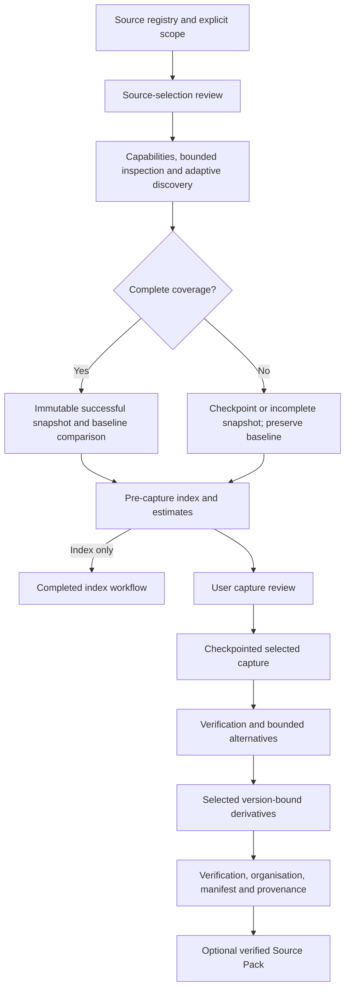

# V1 implementation architecture

The approved specification and refresh/version-history delta define intended behaviour. The Effective Consultancy retrospective is empirical evidence. Its platform-specific scripts and instructions are not product requirements.

The application service orchestrates registry, discovery, snapshots, comparison, review, capture, verification, derivation, manifests and export. Runtime and source interfaces are separate. The V1 source adapter registry has exactly `web` and `filesystem`. The host browser bridge and optional Playwright provider both implement browser capabilities consumed by Web.

The implementation uses a compact Python module layout rather than empty per-feature packages: `domain.py`, `persistence.py`, `application.py`, `planning.py`, `capture.py`, `derivation.py`, `verification.py`, `compendium.py`, `reporting.py`, `packaging.py`, plus `sources/`, `runtimes/` and `interfaces/`. This preserves the reviewed boundaries without placeholder implementations.

## Identity and versions

Project → Source Registry → Source → Placement → Resource → Version → Representation → Content Object.

Resources receive durable identities from source-qualified native IDs where available, otherwise stable locations. Filesystem file IDs provide conservative rename evidence. Source-qualified identities avoid merging logically different items without evidence. Multiple resources and placements can reference the same content-addressed object after SHA-256 verification. A filename is never a content identity.

Discovery revisions are explicitly qualified as observed metadata. Capture creates a version identity tied to actual bytes and representation role. Every derivative points to exact captured inputs and hashes; compendia record all input versions. Earlier versions are never automatically labelled stale, obsolete, irrelevant or superseded.

Snapshots, scope revisions, placements, representations, versions, artefacts, verification, provenance, comparisons and manifests are immutable in SQLite. Source availability, active registry state and execution checkpoints are mutable. Events are append-only. Scope changes invalidate unexecuted approvals and make absence comparisons inconclusive across changed boundaries.

## Persistence and recovery

Each discovery batch is checkpointed with its frontier and usage. A successful snapshot advances the baseline only if no competing scan has already advanced it. Missing resources require successful comparable coverage; access failures produce inconclusive outcomes. Known inaccessible assets remain in the index. Conservative coverage means inaccessible asset branches can leave an entire snapshot incomplete.

Capture persists attempt intent before performing an operation. Objects are hashed and atomically promoted. Artefact, verification and provenance records commit transactionally. Recovery reconciles interrupted attempts with already-committed artefacts and preserves spent attempts. Partially transferred items are retried individually; resumable HTTP Range transfer is not implemented. Completed items and discovery work are reused.

Filesystem discovery and capture use descriptor-relative component walks with no-follow flags on supported POSIX platforms. This keeps parent-directory replacement and nested symlink changes from redirecting an approved read; hard-linked regular files are excluded because inode identity alone cannot distinguish a source alias from a project-private file. Other platforms use the existing pathname checks. The local HTTP runtime resolves and validates each URL immediately before its pinned socket connection, follows only scope-checked redirects, and disables ambient proxy settings. Browser providers remain separate runtime boundaries with provider-specific network and buffering limitations.

Budget renewal uses a new user review and preserves the same run/job identity and checkpoint. Local execution is serialized per project. Browser action requests have durable IDs, while authentication stays outside project state. Waiting for a host action resumes the same attempt.

## Reasoning and classification

Scope, identity bookkeeping, traversal, hashing, method eligibility, copying, conversion, verification, retry budgets, comparisons and manifests are deterministic code. The conversational host interprets selections, explains tradeoffs and can supply evidence-based content-purpose labels through `classify`. The core does not call a model or spend tokens itself. Model capability-level mappings remain runtime-provided; unknown mappings are not invented.

Built-in textual near-duplicate candidates use bounded five-word-shingle similarity. They are not semantic identity judgments. Categories inferred from format are routing aids; purpose labels carry separate evidence. Nothing is silently deleted.

## Deliberate V1 boundaries

No cloud API adapters, wider-web search, automatic monitoring, Academic Assignment Assistant integration, OCR pipeline or semantic supersession judgment. `ExternalDiscoveryProvider` is a documented Protocol without an implementation. Source Pack is optional and preserves explicit omissions rather than claiming archival or offline completeness.
